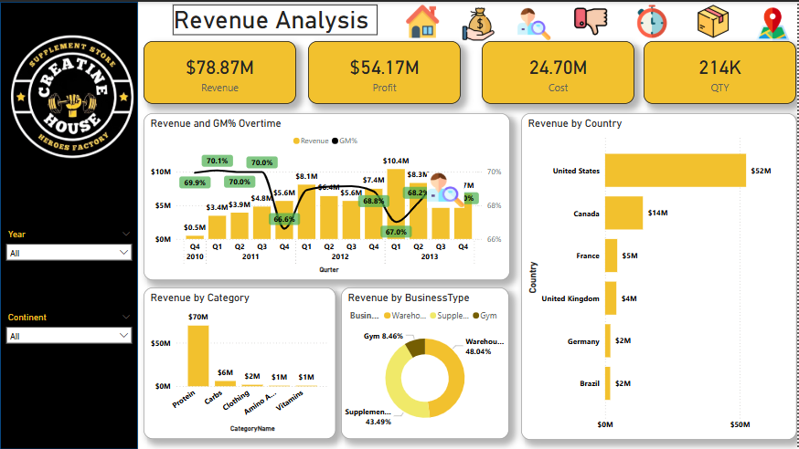
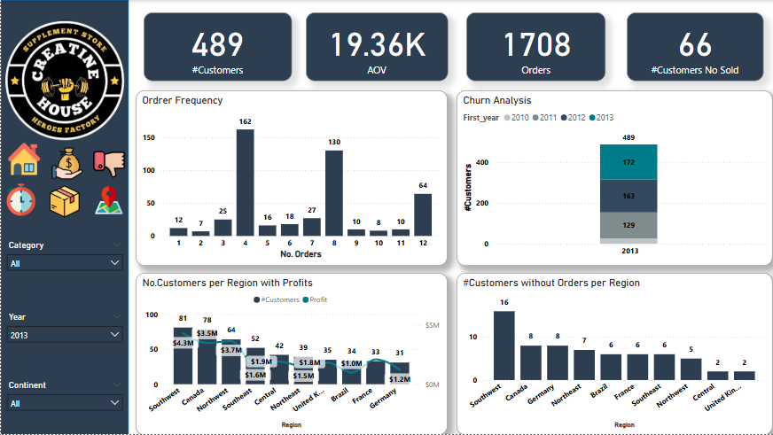
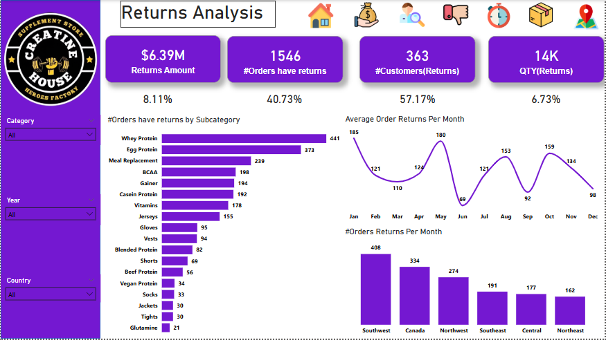
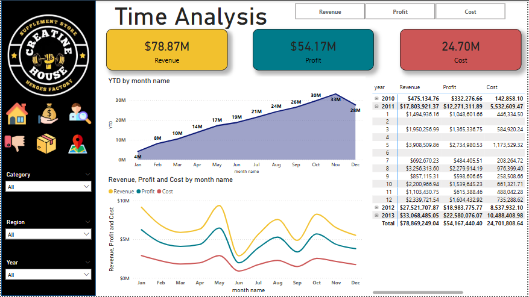
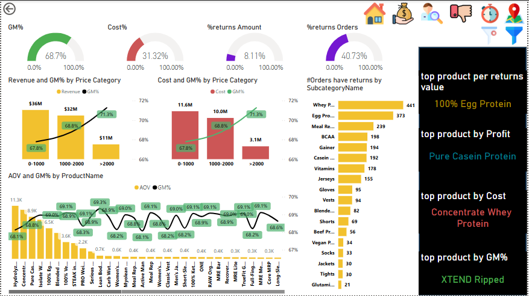
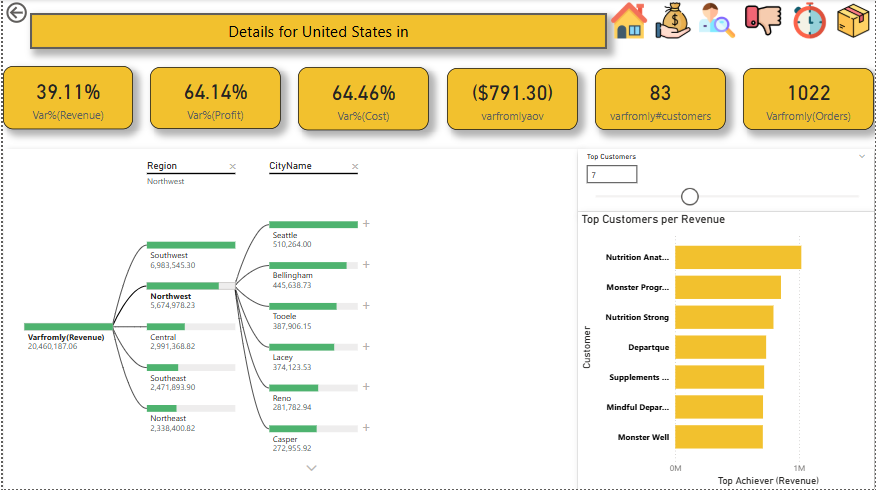

# Creatine House Sales Performance Dashboard

## Table of Contents
1.  [Project Overview](#project-overview)
2.  [Problem Statement](#problem-statement)
3.  [Dashboard Features & Analysis Sections](#dashboard-features--analysis-sections)
4.  [Data Sources](#data-sources)
5.  [Tools & Technologies](#tools--technologies)
6.  [Key Insights & Actionable Recommendations](#key-insights--actionable-recommendations)
7.  [Impact & Value](#impact--value)
8.  [Live Demo](#live-demo)
9.  [How to Use](#how-to-use)
10. [Contact](#contact)

---

## 1. Project Overview

This project showcases a dynamic and interactive **Sales Performance Dashboard** developed for **Creatine House**, a prominent sport supplement brand. The dashboard offers an in-depth analysis of the company's sales data from **2010 to 2013**, transforming raw transactional information into a cohesive and visually intuitive tool. Its primary goal is to empower stakeholders with clear, actionable insights to optimize business strategies and significantly increase profitability.

## 2. Problem Statement

Creatine House faced the challenge of making sense of four years of sales data spread across various sources, lacking a centralized, real-time view of their performance. This hindered their ability to identify core trends, understand customer behavior, manage returns effectively, and make informed decisions on product strategy and geographical expansion. The need was for a comprehensive analytical solution that could translate complex data into clear, profit-driving strategies.

## 3. Dashboard Features & Analysis Sections

The dashboard is meticulously designed with distinct, interactive sections, each addressing critical business dimensions:

* **Revenue Analysis:**
    * Provides a high-level overview of **Revenue, Profit, Cost, and Quantity** over the four-year period.
    * Visualizes **Revenue and GM% Overtime** (Quarterly and Annually), identifying periods of growth, decline, and profit margin trends.
    * Breaks down **Revenue by Country** (e.g., United States, Canada, France) and **Revenue by Category** (e.g., Protein, Carbs, Amino Acids), highlighting top-performing markets and product segments.
    * Shows **Revenue by Business Type** (e.g., Warehouse, Supplement, Gym), indicating key sales channels.
    * 
)
* **Customer Analysis:**
    * Displays key metrics like **Total Customers, Average Order Value (AOV), Orders, and #Customers No Sold**.
    * Analyzes **Order Frequency** to understand purchasing habits.
    * Presents **Churn Analysis** over time, revealing customer retention trends.
    * Maps **#Customers per Region with Profits** and **#Customers without Orders per Region**, pinpointing profitable customer locations and areas requiring attention.
    *  

* **Returns Analysis:**
    * Quantifies **Returns Amount, #Orders have returns, #Customers (Returns), and Quantity (Returns)**.
    * Identifies **#Orders have returns by Subcategory** (e.g., Whey Protein, Egg Protein, Meal Replacement), spotlighting products with high return rates.
    * Analyzes **Average Order Returns per Month** and **#Orders Returns per Month** by region, revealing seasonal return patterns and geographical return hotspots.
    * 
* **Time Analysis:**
    * Provides a year-to-date (YTD) view of **Revenue, Profit, and Cost by Month**, enabling detailed trend analysis over time.
    * Compares **Revenue, Profit, and Cost** month-over-month to identify consistent patterns and outliers.
    * 

* **Product Analysis:**
    * This section would typically detail insights into best-selling products, lowest-performing items, product category profitability, and inventory turnover, allowing Creatine House to optimize their product offerings and stock levels.
   

* **Location Analysis:**
    * This section would typically visualize sales, profit, and customer distribution across different geographic regions or store locations, supporting targeted marketing and expansion strategies.
    

## 4. Data Sources

The dashboard integrates robust datasets derived from:
* **Database Extracts:** Primary transactional data, providing comprehensive sales records.
* **Excel Files:** Supplementary data sources, utilized for specific categorical or demographic information.

*This project was developed as part of practical training within the `data-X` program, focusing on real-world data integration and analytical application.*

## 5. Tools & Technologies

* **Power BI Desktop:** Utilized for the complete lifecycle of the dashboard development, including robust data modeling, complex DAX calculations for KPIs, and the design of highly interactive and visually compelling reports.
* **SQL Server Management Studio (SSMS) GUI:** Employed for initial data querying, exploration, and ensuring the integrity and understanding of the underlying database structure.

## 6. Key Insights & Actionable Recommendations

Through this analysis, several actionable insights and recommendations emerged for Creatine House to enhance profitability:

* **Strategic Resource Allocation:** Identified the highest-performing product categories (e.g., Protein, Carbs) and countries (e.g., United States) to strategically allocate marketing budget and inventory.
* **Returns Mitigation:** Recommendations to reduce returns for subcategories like "Whey Protein" and "Egg Protein" by investigating product quality, improving product descriptions, or refining shipping processes.
* **Customer Engagement:** Insights from order frequency and regional customer distribution suggest developing targeted loyalty programs or expanding marketing efforts in underserved profitable regions.
* **Seasonal Planning:** Precise monthly and quarterly trends from the Time Analysis enable optimization of inventory levels and strategic launch of promotional campaigns during peak sales periods.
* **Profit Optimization:** Analysis of Cost relative to Revenue and Profit across different business types provides opportunities for operational efficiency improvements.

## 7. Impact & Value

This Sales Performance Dashboard provides Creatine House with an unparalleled view of their operational performance. It empowers decision-makers to:

* **Monitor Performance Continuously:** Gain real-time visibility into sales trends and key performance indicators.
* **Optimize Inventory & Operations:** Make data-backed decisions on product stocking, supply chain, and marketing spend.
* **Enhance Customer Loyalty:** Understand customer behavior to foster stronger relationships and reduce churn.
* **Improve Profitability:** Identify inefficiencies, capitalize on growth opportunities, and strategically allocate resources.
* **Drive Strategic Growth:** Inform future market expansion, product development, and overall business strategy with reliable, actionable data.

## 8. Live Demo

Explore the interactive dashboard live on NovyPro: **[[Novypro](https://www.novypro.com/profile_about/mahmoud-mamdouh?Popup=memberProject&Data=1748329372294x310340830017542340)]

## 10. Contact

Feel free to connect with me for any questions, feedback, or collaborations on this project:

* **Linkedin:** **[https://www.linkedin.com/in/mahmoud-mamdouh-324125220/]**
* **Email:** **[mamdouhmahmoud53@gmail.com]** (Optional)
